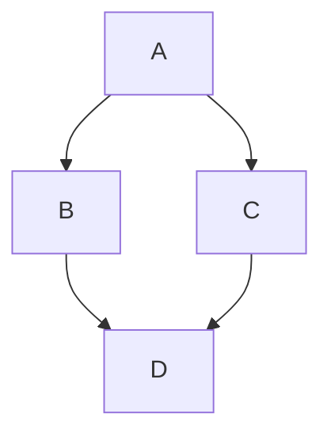

# Charts and Visuals in GitHub Posts

A lane writing a GitHub comment, issue, PR body, or review learns here
which visual to use and the exact markup for it. GitHub renders some
visuals from plain post text and needs an uploaded image for the rest.

## 1. When to use which

| Situation | Use | Why |
| --- | --- | --- |
| One fact or short story | Prose | Nothing to compare |
| Same fields across items | Table | Rows line up |
| Flow, order, relations | Mermaid diagram | Shape carries the meaning |
| Pixels, plots, screenshots | Uploaded image | Text cannot draw it |
| Formula | LaTeX math | Renders cleanly |
| Long log or dump | Collapsed details block | Keeps the post short |

Post sections follow this order: what was happening, change,
validation, visual. The table carries validation numbers. The image
carries the overview. Neither repeats the other.

## 2. Markdown comparison tables

Use a table when items share the same fields. Test outcomes, option
lists, and before and after values are the common cases.

Rules: pipes separate columns. The second row is hyphens, at least
three per column. Leave a blank line before the table. Colons in the
hyphen row set alignment. Cells take links, inline code, bold, and
italic. A backslash escapes a literal pipe.

```markdown
| Case | Main runner | This PR |
| --- | --- | --- |
| Unit tests | 41 pass | 41 pass |
| New tests | 0 | 3 pass |
```

Keep tables narrow. Three to five columns is the practical max. Long
prose never belongs in cells. Put the conclusion above the table in one
sentence, not below it.

## 3. Mermaid diagrams

Use a diagram when order or relations matter. Flows, sequences, and
state changes beat tables there.

Syntax: a fenced code block tagged mermaid. GitHub renders it in
issues, discussions, pull requests, wikis, and markdown files.

````markdown

````

Allowlisted diagram types at v1: `graph`, `flowchart`,
`sequenceDiagram`, `gantt`, `pie`, `erDiagram`, `stateDiagram-v2`.
Anything else fails closed. The exact set follows the Mermaid version
GitHub has pinned, and version drift can add or drop types, so confirm
with a block holding only the word `info` before relying on a new type.
Keep diagrams small. Past six nodes, split the diagram or use an image.

Validate before posting:

    python3 skills/charts-in-posts/scripts/check-mermaid.py <draft.md>

Exit 0 means every fence is valid. Exit 1 names the failing fence and
the reason. Exit 2 means the file could not be read. Copy-ready working
examples for each type live in `references/mermaid-gallery.md`.

## 4. Images and infographics

Use an image for anything pixel based. Screenshots, plotted charts, and
designed infographics cannot be written as post text.

Upload path: drag the file into the comment box, or use the attach
control below it. Pasting from the clipboard works in many browsers.
PNG, GIF, JPG, JPEG, and SVG are accepted. The limit is 10 MB per
image.

GitHub returns an anonymized URL under githubusercontent.com, proxied
through Camo. Embed it with markdown image syntax and plain alt text.

```markdown

```

Alt text states what the image shows. It never repeats the file name.
One image per post is the default. Two at most. More than that belongs
in a linked artifact, not inline. Anyone holding the URL can view the
file, so sensitive images never go into a post.

## 5. Protean gates

Load the `clean-writing` skill before drafting any post text. Run
`check-prose.py` on the draft file and require exit 0 before posting,
plus `--dupes` exit 0 when posting. Posts carry no external image URLs.
Every image is a GitHub attachment. Every draft goes through the
`draft-review-html` pipeline for human review before any post
call. A second team member proofreads the rendered draft. The author
never audits their own writing.

### Visual value gate (automatic, advisory)

`scripts/protean-drafts/visual-value-gate.py` runs automatically in
the draft pipeline on every draft, right after the prose gate. It is
conservative by design: NOT-WARRANTED is the common case, and a draft
that stays prose passes. When it fires WARRANTED, the suggested visual
type (table, mermaid, or image) is a recommendation, not a mandate —
the author's judgment overrides the gate (`--skip-visual-gate`).
When the draft already holds a visual, the gate reports VALIDATION
and the pipeline validates any ```mermaid fences via
`check-mermaid.py` instead of suggesting anything.

Docs sources: [tables](https://docs.github.com/en/get-started/writing-on-github/working-with-advanced-formatting/organizing-information-with-tables),
[diagrams](https://docs.github.com/en/get-started/writing-on-github/working-with-advanced-formatting/creating-diagrams),
[attachments](https://docs.github.com/en/get-started/writing-on-github/working-with-advanced-formatting/attaching-files).

## 6. Anti-patterns

- A wall of prose where a three-column table would line the facts up.
- A table describing a flow (use a Mermaid diagram) or pixels (use an
  image).
- A diagram with more than six nodes that nobody can follow.
- An external image URL in a post. Upload the file to GitHub instead.
- A missing alt text on an image a reviewer cannot see.
- Two visuals saying the same thing as each other or as the prose.
- Posting without the pipeline render, the prose gate, and the second
  proofread from section 5.
