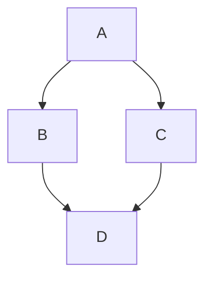
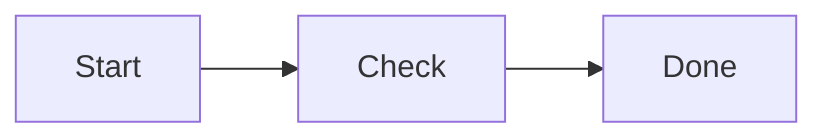
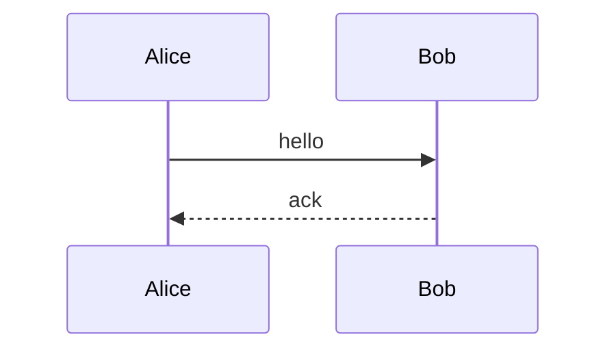
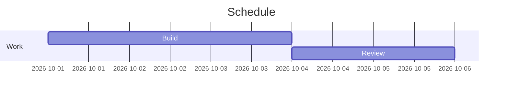
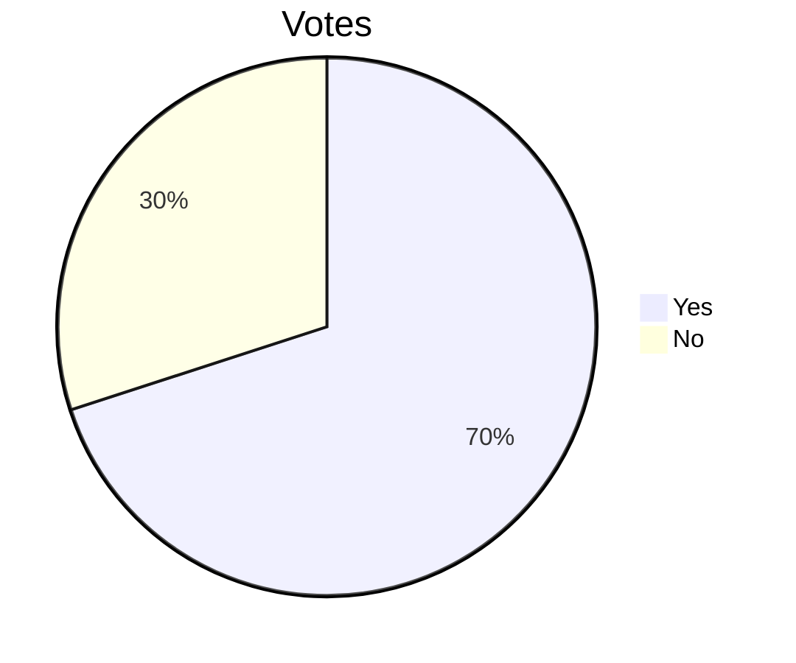
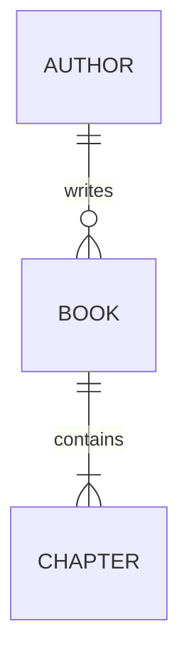
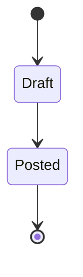

# Mermaid gallery: one working example per allowlisted type

Every block below passes `scripts/check-mermaid.py`. Copy a block into a
post draft and replace the labels. Keep diagrams small: past six nodes,
split the diagram or use an image instead.

## graph

## flowchart

## sequenceDiagram

## gantt

## pie

## erDiagram

## stateDiagram-v2

